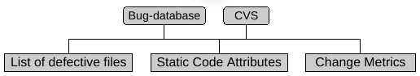

# Metrics in Software Enginering Prediction

There are many types of metrics that can be easily collected from source code or software configuration management systems. 

Most work have focused on static metrics from code but recently other metrics 

(Source: Moser et al)

Change Metrics describe how a file changed in the past, e.g., REVISIONS, REFACTORINGS, BUGFIXES, LOC_ADDED, etc.

## Complexity Metrics

These metrics have been used for quality assurance during:
 
 + Development to obtain quality measures, code reviews etc.
 + Testing to focus and prioritize testing effort, improve efficiency etc.
 + Maintenance as indicators of comprehensibility of the modules etc.  

Generally, the developers or maintainers use rules of thumb or threshold values to keep modules, methods etc. within certain range. For example, if the cyclomatic complexity ($v(g)$) of a module is between 1 and 10, it is considered to have a very low risk of being defective; however, any value greater than 50 is considered to have an unmanageable complexity and risk. For the essential complexity ($ev(g)$), the threshold suggested is 4 etc. Although these metrics have been used for long time, there are no clear thresholds, for example, although McCabe suggests a threshold of 10 for $v(g)$, NASA's in--house studies for this metric concluded that a threshold of 20 can be a better predictor of a module being defective.

Several authors have studied the relation between lines of code and defects, for example, [@Zhang2009]

### McCabe's Complexity Measures

McCabe defined a set of complexity measures based on the graph of a program [@mccabe76]:

+ Cyclomatic complexity $v(g)$ is number of the control graph of the function $v(g)=e-n+2$, where $e$ represents the number of edges and $n$ the number of nodes.

+ Module Design Complexity $iv(G)$

+ Essential Complexity $ev(G)$ is a measure of the degree to which a module contains unstructured constructs

### Halstead-s Software  Science

Late 70s, Halstead developed a set of metrics based on [@Halstead77]:

+ Operators,  keywords such as `if`, `while`, `for`, operators `+`, `=`, `AND`, etc.
+ Operands, program variables and constants.
programa.
\end{itemize}

All metrics are calculated using the following:

 + $n_1$, number of distinct operators
 + $N_1$, total number of operators
 + $n_2$, number of distinct operands
 + $N_2$, the total number of operands

For example, given the following excerpt:

    if (MAX < 2) {
        a = b * MAX;
        System.out.print(a);
    }

We obtain the following values:

  + $n1 = 6$ (`if, { }, System.out.print(), =, *, $<$`)
  + $N1 = 6$ (`if, { }, System.out.print(), =, *, $<$`)
  + $n2 = 4$ (`MAX, a, b, 2`)
  + $N2 = 6$ (`MAX, 2, a, b, MAX, a`)

Using this four variable, several metrics are calculated.

+ Program vocabulary ($n = n_{1} + n_{2}$), as a measure of complexity, the less number of elements, the simpler it should be the program.

+ Program length, $N = N_{1} + N_{2}$, as a proxy for size, the larger it is, the harder it is to understand it. Program length can be estimated with $\hat{N} = N_{1} log_2 n_1 + N_{2} log_2 n_2$ (calculated program length)

+ Volumen, $V = N \cdot log_{2}(n)$, number of bits needed to codify a program. While $length$ is just the count of operators and operands, the $volumen$ considers the number of distint operators. Given two same size programs, the one of with more distint operators will be harder to understand, i.e, greater volumen.

 + Level, $L=V'/V$, where $V'$ is the potential volumen (minimun number of operands and operators needed and $V$. As $V'$ is difficult to calculate, it can be approximated with $\hat{L}= \frac{n_1'}{n_1} \cdot \frac{n_2}{N_2}$, where $n_1'$ is the minimun number of distint operators.

+ Mental effort, $E = V / L$,  where $L$ depends on the programming language. It  can also be calculated as $E = \frac{n_1 N_2 N log_2 n}{2 n_2}$

+ Time, $T=E/S$, time to develop a program in seconds, being $S$ the number of metal discrimitaions with a value between  $5 \leq S \leq 20$.

+ Inteligence, $i = (2n_{2} / n_{1}N_{2} ) \cdot (N_{1} + N_{2})log_{2}(n_{1} + n_{2})$

Although these metrics are still highly used, they are also criticised, e.g., the mental discriminations is very hard to define and calculate. 

## Object-Oriented Metrics

chidamber and Kemerer introduced a set of OO complexity Metrics that is being highly used [@Chidamber1994].

+ Coupling Between Objects (CBO) for a class is a count of the number of other classes to which it is coupled. Coupling between two classes is said to occur when one class uses methods or variables of another class. COB is measured by counting the number of distinct non-inheritance related class hierarchies on which a class depends.

+ Depth of Inheritance Tree (DIT) measures the maximum level of the inheritance hierarchy of a class; the root of the inheritance tree inherits from no class and is at level zero of the inheritance tree. Direct count of the levels of the levels in an inheritance hierarchy.

+ Number of Children (NOC) is the number of immediate subclasses subordinate to a class in the hierarchy. NOC counts the number of subclasses belonging to a class. According to C&K, NOC indicate the level of reuse, the likelihood of improper abstraction and as possible indication of the level of testing required.

+ Response For a Class (RFC) is the count of the set of all methods that can be invoked in response to a message to an object of the class or by some method in the class. According to C&K, RFC is a measure of the complexity of a class through the number of methods and the amount of communication with other classes. 
+ Weighted Methods per Class (WMC) measures the complexity of an individual class. If all methods are considered equally complex, then WMC is simply the number of methods defined in each class. C&K suggests that WMC is intended to measure the complexity of a class. Therefore, it is an indicator of the effort needed to develop and maintain a class. 

+ Lack of Cohesion in Methods (LCOM) measures the extent to which methods reference the classes instance data. 

+ Etc.

Jurescko and Spinellis [@JureczkoS10]

Bansiya and Davis,  A hierarchical model for object-oriented design quality assessment [@BansiyaD02]

## Churn and Process Metrics

Churned LOC is usually the number of source code lines added, deleted or changes to a component between a baseline version and a new version.

Authors can also count the number of files created/deleted and the time span between those changes.

Madeyski and Jurescko present a taxonomy of process metrics [@Madeyski2015]:

| Metric            | Source code  |  Developers  | Defects | 
| ----------------- | ---------- | ------------ | --------- |  
| Number of Revisions (NR)       | X  |  |  | 
| Number of Modified Lines (NML) | X  |  |  | 
| Is New (IN)                    | X |  |  | 
| Number of Distinct Commiters (NDC)  | X |  X |  | 
| Number of Defects in Previous Version (NDPV)  | X |   | X  | 

A Comparative Analysis of the Efficiency of Change Metrics and Static Code Attributes for Defect Prediction [@MoserPS2008] 

A futher description of typical metrics used [@KrishnanSLG2011]:

| Metrics 	| Definition | 
| ----------|-------------------------------------------| 
| COMMITS 	| Number of commits a file has gone through | 
| REFACTORINGS	| Number of times a file has been refactored | 
| BUGFIXES 	| Number of times a file has been involved in bug fixing | 
| AUTHORS 	| Number of distinct authors that made commits to the file | 
| LOC-ADDED 	| Number of lines of code added to the file | 
| MAX-LOC-ADDED 	| Maximum number of lines of code added for all commits | 
| AVG-LOC-ADDED 	| Average lines of code added per commit | 
| LOC-DELETED 	| Number of lines of code deleted from the file | 
| MAX-LOC-ADDED	| Maximum number of lines of code deleted for all commits | 
| AVG-LOC-ADDED 	| Average lines of code deleted per commit | 
| CODECHURN 	| Sum of all commits (added lines of code deleted lines of code) | 
| MAX-CODECHURN 	| Maximum CODECHURN for all commits | 
| AVG-CODECHURN 	| Average CODECHURN per commit | 
| MAX-CHANGESET 	| Maximum number of files committed together with the repository | 
| AVG-CHANGESET 	| Average number of files committed together with the repository | 
| WEIGHTED-AGE 	| Age of a file normalized by added lines of code | 

