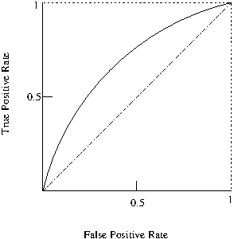

## Graphical Evaluation

### Receiver Operating Characteristic (ROC)

The *Receiver Operating Characteristic* ($ROC$) curve which provides a graphical visualisation of the results [@Fawcett2006].

The Area Under the ROC Curve (AUC) also provides a quality measure between positive and negative rates with a single value. 

A simple way to approximate the AUC is with the following equation:
$AUC=\frac{1+TP_{r}-FP_{r}}{2}$

### Precision-Recall Curve (PRC)

Similarly to ROC, another widely used evaluation technique is the Precision-Recall Curve (PRC), which depicts a trade off between precision and recall and can also be summarised into a single value as the Area Under the Precision-Recall Curve (AUPRC) [@Davis2006].

AUPCR can be more accurate than the ROC measure for testing performances when dealing with imbalanced datasets.

### Cost Curves

This was originaly proposed by Drummond and Holte to visualize classifier performance and the cost of misclassification [@DrummondH2006]. Cost curves plot the probability cost function on the $x$-axis and the normalized expected misclassification cost on the $y$-axis.

Jiang et al. used cost curves as evaluation measure in defect prediciton [@Jiang2008]. 

