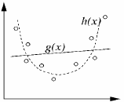
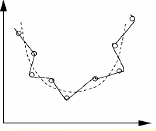
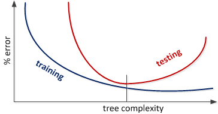

## Underfitting vs. Overfitting

 

For example, increasing the tree size, decreases the training and testing errors. However, at some point after (tree complexity), training error keeps decreasing but testing error increases. Many algorithms have parameters to determine the model complexity (e.g., in decision trees is the prunning parameter)

