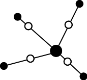
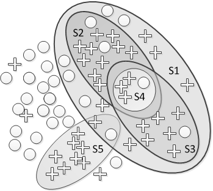
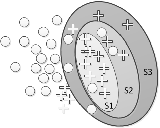
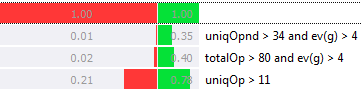
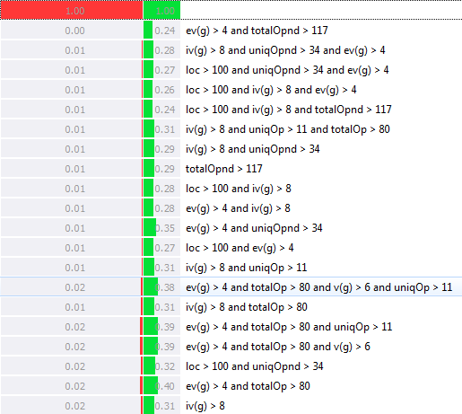
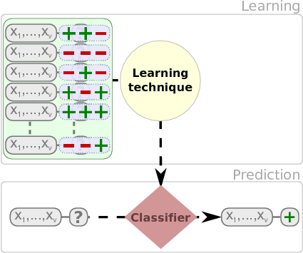
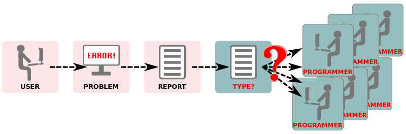

# (PART) Examples {-} 

# Feature Subsect Selection in Defect Prediction

Feature Subsect Selection (FSS) is important in different ways:

+ A reduced volume of data allows different data mining or searching techniques to be applied.

+ Irrelevant and redundant attributes can generate less accurate and more complex models. Furthermore, data mining algorithms can be executed faster.

+ We can avoid the collection of data for those irrelevant and redundant attributes in the future.

FSS algorithms search through candidate feature subsets guide by a certain evaluation measure which captures the goodness of each subset. An optimal (or near optimal) subset
is selected when the search stops. There are two possibilities when applying FSS:

+ The _filter model_ relies on general characteristics of the data to evaluate and select feature subsets without involving any data mining algorithm.

+ The _wrapper model_ requires one predetermined mining algorithm and uses its performance as the evaluation criterion. It searches for features better suited to the mining algorithm aiming to improve mining performance, but it also tends to be more computationally expensive than filter model.

We applied Feature Subset Selection (FSS) to several datasets publicly available (PROMISE repository), and different classifiers to improve the detection of faulty modules.
[@RRCA07] Detecting Fault Modules Applying Feature Selection to Classifiers

Khoshgoftaar et al have studied FS extensively together with imbalance, noise etc. For example in:

[@KhoshgoftaarGKN12] Exploring an iterative feature selection technique for highly imbalanced data sets

# Imbalanced data

Most publicly available datasets in software defect prediction are highly imbalanced, i.e., samples of non-defective modules vastly outnumber the defective
ones.

Data mining algorithms generate poor models because they tend to optimize the overall accuracy or AUC but perform badly in classes with very few samples (minority class which is usually the one we are interested in).

It is typically addressed by preprocessing the datasets with sampling techniques [Afzal2012IJSEKE] or considering cost in the data mining algorithms (making the algorithms more robust). This problem happens in many of the defect prediction datasets (e.g. the PROMISE repository has around 60 defect prediction datasets). The previous problems, redundant and irrelevant attributes, overlapping, data shifting and small datasets are made worse when datasets are imbalanced [@FGH11] and ad-hoc approaches may be needed [@KhoshgoftaarGKN12] in feature selection.

Different approaches include:

+ _Sampling_: Sampling techniques are classified as oversampling or undersampling and are based on adding or removing instances of the training dataset 

  * Random OverSampling (ROS) replicates instances from the minority class towards a more balanced distribution 
  
  * Random Under-Sampling (RUS) removes instances from the majority class 
  
  More intelligent approaches include SMOTE (Synthetic Minority Over-sampling Technique)
generates new instances based on a number of nearest neighbours ($k$-NN) There are other variations of SMOTE (Borderline SMOTE) 
  

+ _Cost-Sensitive Classifiers_ (CSC) penalises differently the
type of errors

+ _Ensembles_: Bagging (Bootstrap aggregating), boosting and stacking (Stacked generalization) which combines different types of models

+ _Robust algorithms_: algorithms or modification to algorithmsdesigned to work with unbalanced data [@Ibarguren2017]

[@SeiffertEtAl07] An empirical study of the classification performance of learners
	on imbalanced and noisy software quality data

# Subgroup Discovery

Subgroup Discovery (SD) aims to find subgroups of data that are statistically different
given a property of interest. [@Klosgen96] [@Wrobel97] [@Wrobel01] 

A comprehensive survey by [@HCGJ11]. 

SD lies between predictive (finding rules given historical data and a property of interest) and descriptive tasks (discovering interesting patterns in data). An important difference with classification tasks is that the SD algorithms only focus on finding subgroups (e.g., inducing rules) for the property of interest and do not necessarily describe all instances in the dataset.

In general, subgroups are represented through _rules_ with the form {$Cond \rightarrow
Class$} having as consequent ($Class$) a specific value of an attribute of interest. The
antecedent ($Cond$) is usually composed of a conjunction of attribute--value pairs
through relational operators. Discrete attributes can have the form of $att=val$ or $att \neq val$ and for continuous attributes ranges need to be defined, i.e., $val_1 \leq att
\leq val_2$.
 
 
|                 |Classification       | Subgroup Discovery      |
|-----------------|---------------------|-------------------------|
| Induction Type  |Predictive           | Descriptive            |
|Output           | Set of classification rules | Individual rules to describe subgroups
Purpose           | To learn a classification model | To find interesting and interretable patterns |
 

It is worth noting that we do not cover all examples

This has been applied to deal with imbalanced [@RodriguezEtAlINS12]

Classical algorithms include the SD, CN2-SD algorithms etc.

Using the CN2-SD algorithm with the KC2 dataset:

And with 

# Semi-supervised learning

Semi-Supervised Learning (SSL) lies between supervised and unsupervised techniques, where a small number of instances in a dataset are labeled but a lot of unlabeled data is also
available.

 + Supervised all data labelled

 + _Semi-supervised_ both labelled and unlabelled data

 + Unsupervised no class attribute (all unlabelled)

Given a dataset, $\mathcal{D}$:
 
 + $\mathcal{D} = \mathcal{L} \bigcup \mathcal{U}$
 
 + Learner $f:\mathcal{X} \mapsto \mathcal{Y}$
 
 + Labeled data $\mathcal{L}$ = $(X_i, Y_i) = \{(x_{1:l}, y_{1:l}) \}$
 
 + Unlabeled data $\mathcal{U}$ = $X_u = \{x_{l+1:n}\}$ \\(avalilable during training, usually $l << n$)
 
 + Test data $X_{test} = \{x_{n+1:\ldots} \}$

In SSL, threre are two distinct goals:

+ _Inductive_. Predict the labels on future test data, i.e.,
learning models are applied to future test data (not
avalilable during training).
 $\{(x_{1:l}, y_{1:l}), x_{l+1:n},  x_{n+1:\ldots} \}$

+ _Transductive_. It is concerned with predicting the labels on
the unlabeled instances provided with the training sample.
 $\{(x_{1:l}, y_{1:l}), x_{l+1:n} \}$

Self-training Algorithm

Input: Labeled data $\mathcal{L}$, unlabeled data $\mathcal{U}$, and a supervised learning algorithm $\mathcal{A}$.

1. Learn a classifier $f$ using labeled data $\mathcal{L}$ with $f$.

2. Label unlabeled data $\mathcal{U}$ with $f$.

3. Add new labeled data to $\mathcal{L}$ and removed them from $\mathcal{U}$

For each class $C$, select examples which $c$ labels as $C$ with high confidence, and add it to the labeled data.

Repeat 1--3  until it converges or no more unlabeled example left.\\

[@DHR2017] Preliminary Study on Applying Semi-Supervised Learning to App Store Analysis
In Appstore, classifying reviews into: _bugs_, _request_ and _other_.

In defect prediction:

[@LuCC2012] Software defect prediction using semi-supervised learning with dimension reduction

[@Li2012] Sample-based software defect prediction with active and semi-supervised learning

# Learning from Crowds

# Multi-objective Rules for defect prediction

We are applying MOQAR (multi-objective evolutionary schemes to discover quantitative association rules) to defect prediciton rules

[@Martinez2016] Improving a Multi-objective Evolutionary Algorithm to Discover Quantitative Association Rules

# Settings Thresholds for Defect Prediction

## Use of Mean and Standard Deviation 

Some of the methods proposed in the literature suggest that the threshold for a given measure $X$ should be based on its distribution. 

More specifically, both Erni and Lewerentz [10] and Lanza and Marinescu [19] describe methods to define thresholds based on the mean value and the standard deviation of measures. 

As an applicability precondition, both proposals assume that X follows a normal distribution.

According to [10], the interval $[\mu − \sigma, \mu + \sigma]$ is regarded as the central range of _normal_ values for $X$, where $\mu$ and $\sigma$ are the average and the standard deviation of the distribution of $X$, respectively.

The proposal of [19] takes $\mu - \sigma$ as the “low” threshold, $\mu + \sigma$ as the "high" threshold, and $1.5(\mu + \sigma)$ as the "very high"" threshold. In addition, the proposal suggests the use of "meaningful"" thresholds, which can be derived based on

  1. commonly-used fraction thresholds (e.g., 0.75) and 

  2. thresholds with generally-accepted meaning, $\mu - \sigma$ and $\mu + \sigma$.

## Use of Weighted Benchmark Data

Alves et al. use data from multiple different software systems to derive thresholds that are expected to "(i) bring out the metric’s variability between systems and (ii) help focus on a reasonable percentage of the source code volume" [@Alves2010].

## Use of Quantiles

Quantiles can also be used to set thresholds

## Some further literature

[@Benlarbi2000] Thresholds for object-oriented measures

[@Morasca2016] Slope-based Fault-proneness Thresholds for Software Engineering Measures
